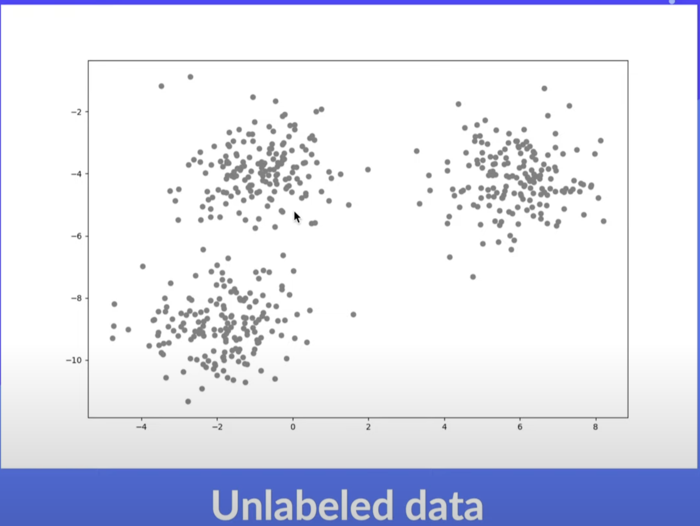
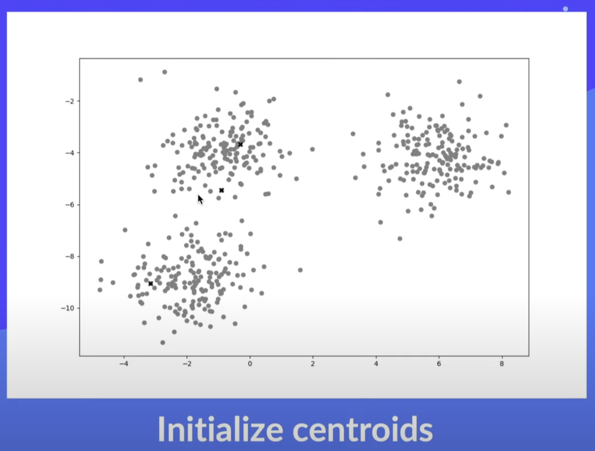
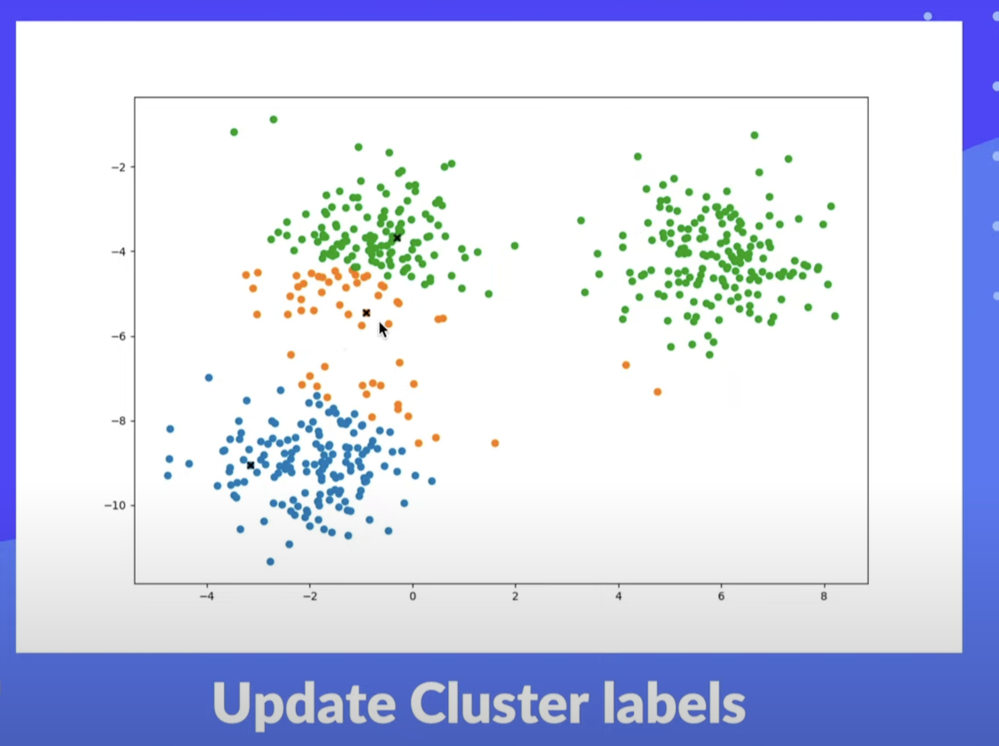
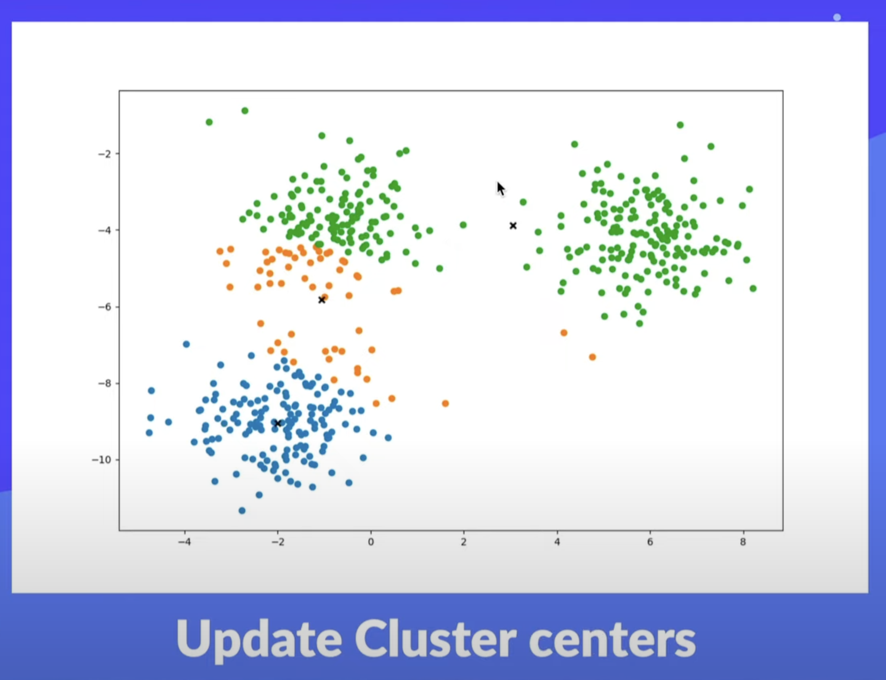
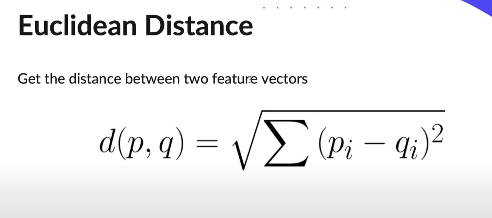

# KMeans

KMeans is an <b>unsupervised learning</b> method (unlabelled data) that clusters data set into k different clusters. Each sample is assigned to the cluster with the nearest mean, and then the meams (centroids) and clusters are updated during an iterative optimization process.

## Iterative Optimization

<ol>
    <li> Initialise cluster centers (e.g. randomly)</li>
    <li> Repeat until converged:
        <ul>
            <li> Update cluster labels: Assign points to the nearest cluster center (centroid)</li>
            <li> Update cluster centers (centroids): Set center to the mean of each cluster</li>
        </ul>
    </li>
</ol>

