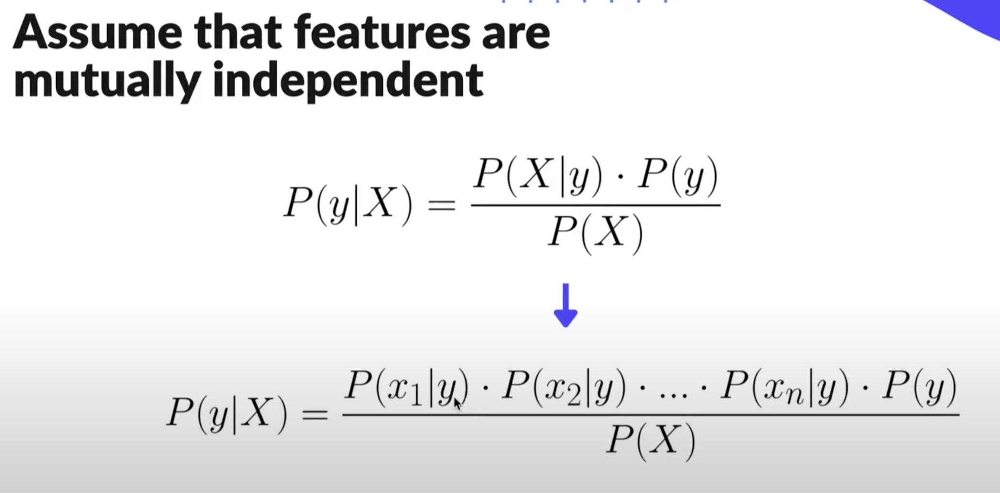
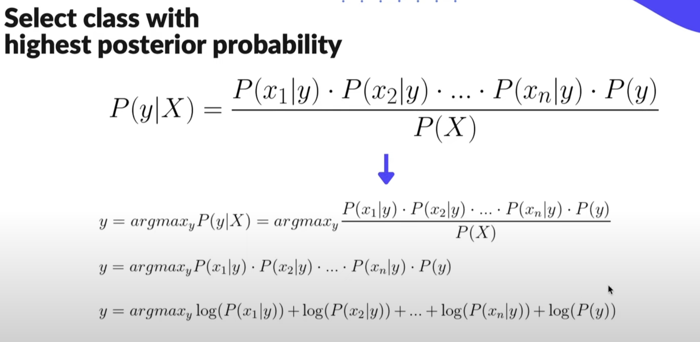
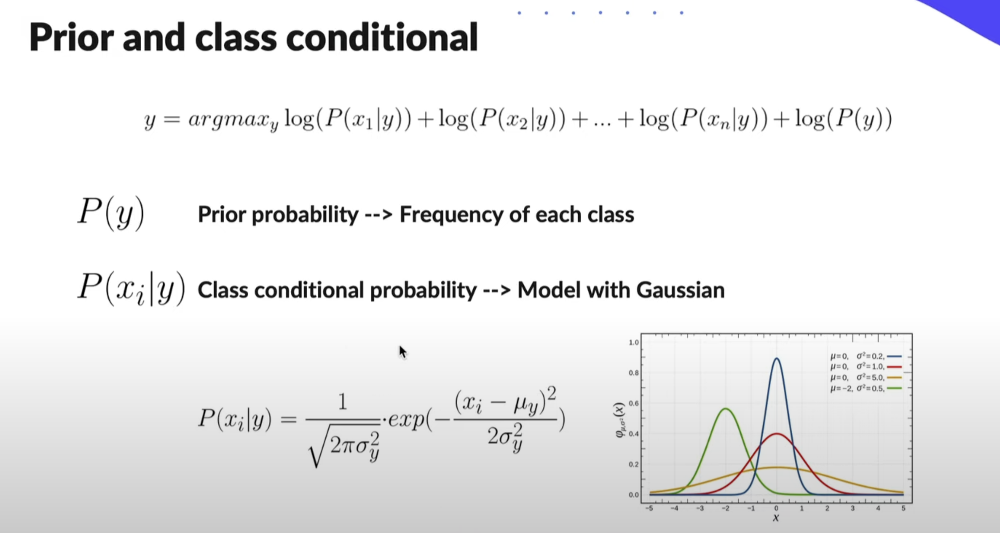

# Naive Bayes

The Naive Bayes classifier is a "probabilistic classifier" based on applying Bayes' theorem with strong (naive) independence assumptions between the features.

 

 

 

 

## Steps

### Training: 
<ul>
    <li> Calculate mean, var, and prior (frequency) for each class</li>
</ul>

### Predictions:
<ul>
    <li> Calculate posterior for each class with log formula(Refer to image) and Gaussian Formula.</li>
    <li> Choose the class with the highest posterior probability</li>
</ul>

