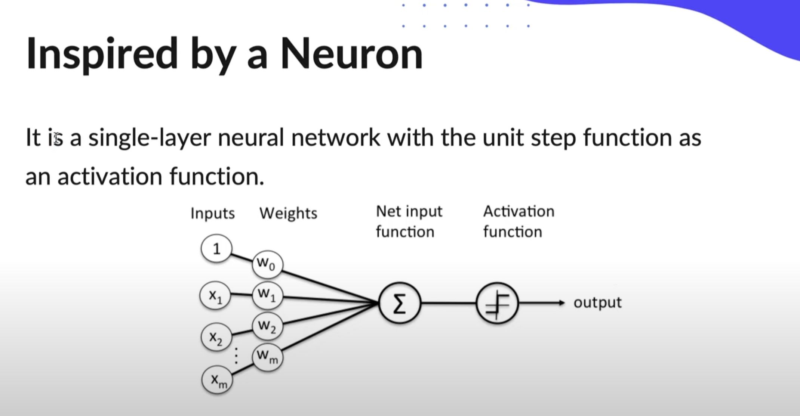
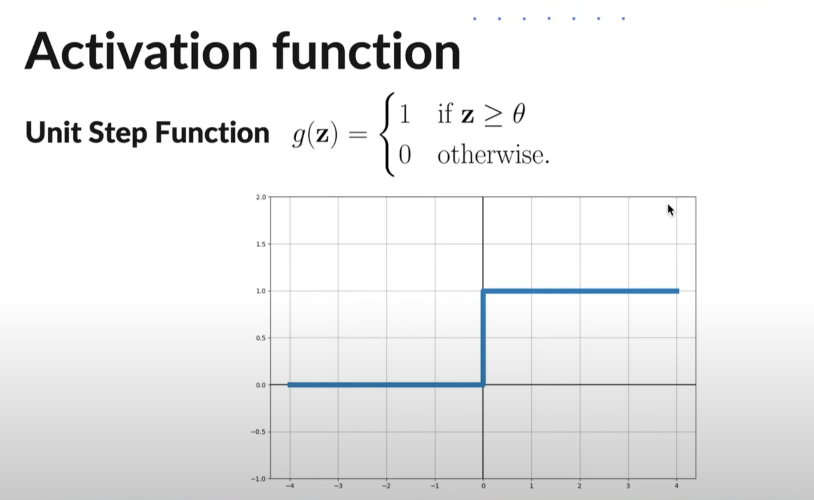
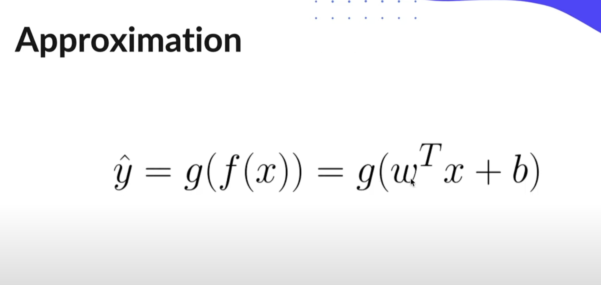
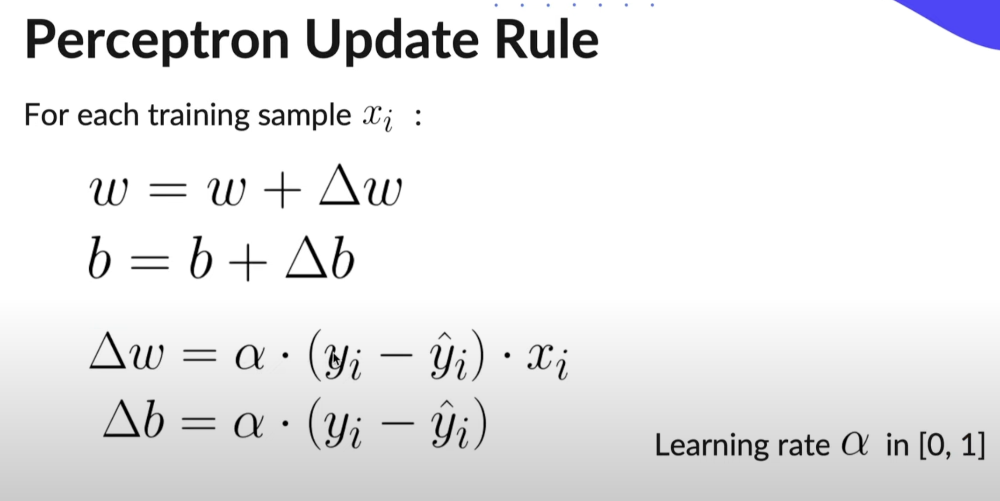

# Perceptron

The Perceptron is an algorithm for supervised learning of binary classifiers. It can be seen as a single unit of an artificial network and is also known as the Protype for Neutral Nets.

<b> Single Layer Perceptron: Can learn only linearable separable patterns</b>
Multilayer Perceptron: Can learn more complex patterns

 

 

 

## Steps

### Training(Learning Weights)
<ul>
    <li> Initialize weights</li>
    <li> For each sample:
        <ul>
            <li> Calculate y = g(f(x))</li>
            <li> Apply update rule: Change in w, change in b</li>
        </ul>
    </li>
</ul>

### Prediction:
<ul>
    <li> Calculate y = g(f(x))</li>
</ul>

