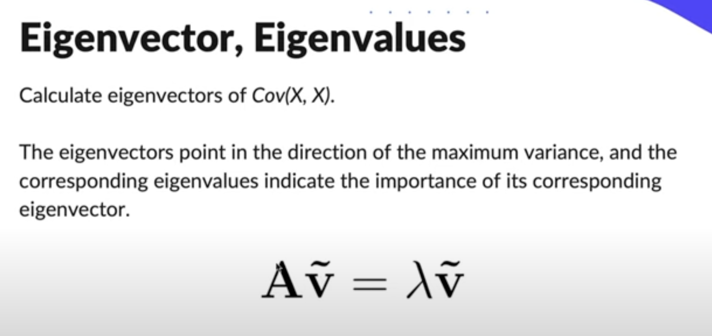

# Principal Component Analysis

## PCA: Goal

Principle Componenent Analysis, or PCA, is an <b>unspervised learning method</b> that is often used to reduce the dimensionality of the dataset by transforming a large set into a lower dimensional set that still contains most of the information of the large set.

PCA finds a new set of dimensions such that all the dimensions are orthogonal (and hence linearly independent) and ranked according to the variance of data. 

Find a transformation such that 
<ul>
    <li> The transformed features are <b>linearly independent</b></li>
    <li> <b>Dimensionality can be reduced</b> by taking only the dimensions with the highest importance</li>
    <li> Those newly found dimensions should <b>minimise the projection error</b></li>
    <li> The projected points should have maximum spread, i.e. maximum variance</li> 
</ul>

 

 

### Steps
<ul>
    <li> Subtract the mean from X</li>
    <li> Calculate Cov(X, X)</li>
    <li> Calculate the eigenvectors and eigenvalues of the covariance matrix</li>
    <li> Sort the eigenvectors according to their eigenvalues in decreasing order</li>
    <li> Choose the first k eigenvectors and that will be the new k dimensions</li>
    <li> Transform the original n-dimensional data points into k dimensions(= Projections with dot product)</li>
</ul>

