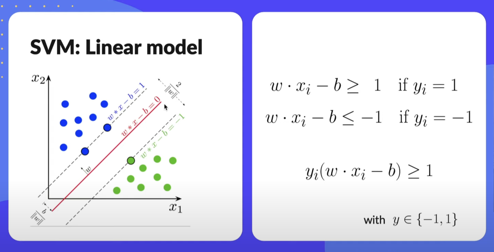
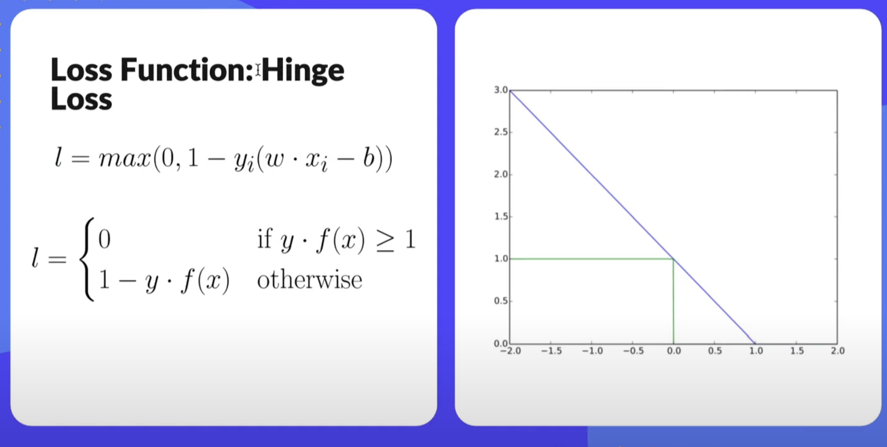
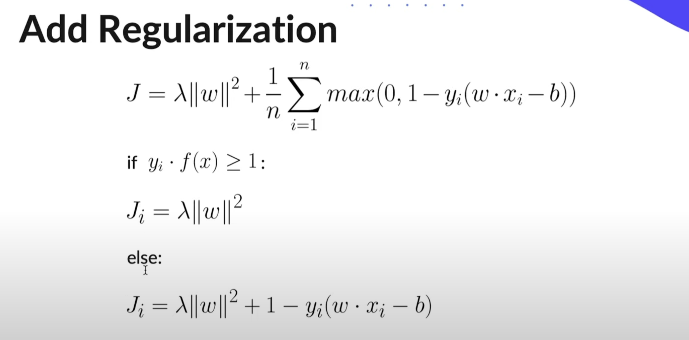
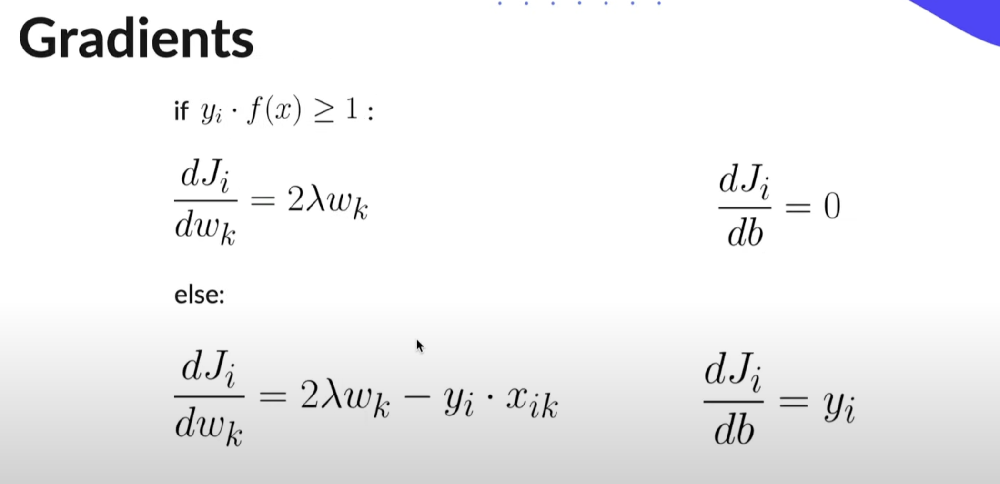
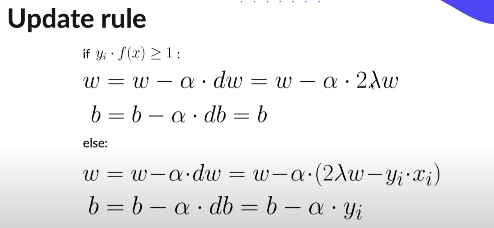

# Support Vector Model (SVM)

Idea: Use a linear model and try to find a linear decision boundary (hyperplane) that best separates the data. The best hyperplane is the one that yields the largest separation/margin between both classes. So we choose the hyperplane so the distance from it to the nearest data point on each side is maximised.

## Steps

### Training(Learn Weights):
<ul>
    <li> Initialise weights</li>
    <li> Make sure y E {-1, 1}</li>
    <li> Apply update rule for n-iterations</li>
</ul>

### Prediction:
<ul>
    <li> Calculate y = sign(w . x - b)</li>
</ul>

